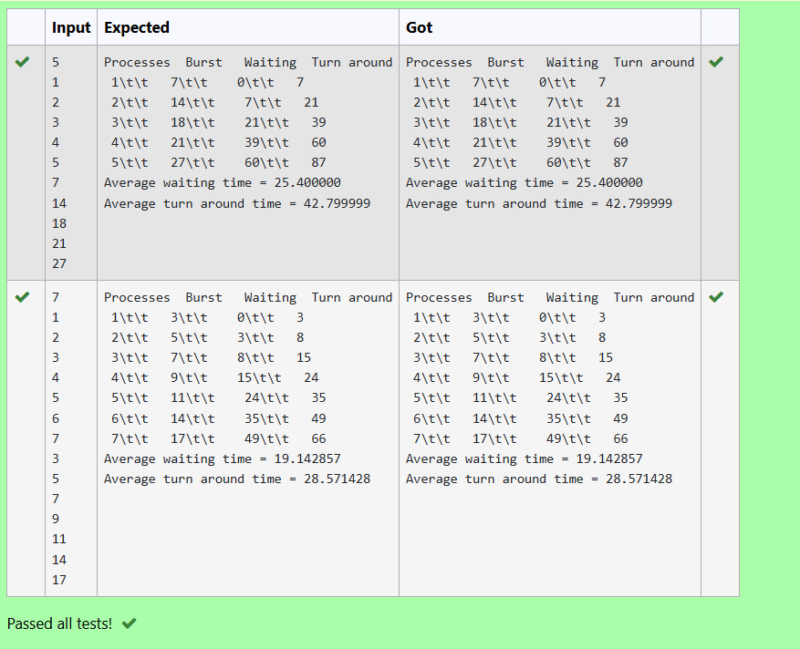

# Ex10 Applications of Queue – FCFS
## DATE:
## AIM:
To write a C function to calculate the turnaround time of each process given their burst time and waiting time in First Come first Serve scheduling algorithm.
## Algorithm
1. Loop through all processes from i = 0 to n-1.
2. For each process, access its burst time and waiting time.
3. Add burst time and waiting time to get turnaround time.
4. Store the result in the `tat[]` array at the same index.
5. After the loop ends, return 0 to indicate successful execution. 

## Program:
```
/*
Program to find and display the priority of the operator in the given Postfix expression
Developed by: D VERGIN JENIFER
RegisterNumber: 212223240174
/*#include <stdio.h>*/
int turnaroundtime( int proc[], int n,int burst_time[], int wait_time[], int tat[]) {
   // calculating turnaround time by adding
   // burst_time[i] + wait_time[i]
   int i;
   for(i=0;i<n;i++){
       tat[i]=burst_time[i]+wait_time[i];
   }
   return 0;
}
*/
```

## Output:



## Result:
Thus, the C function to calculate the turnaround time of each process given their burst time and waiting time in First Come first Serve scheduling algorithm is implemented successfully.
