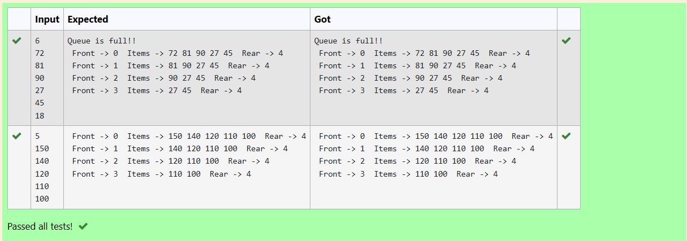

# Ex6 Dequeue Elements from Circular Queue
## DATE:
## AIM:
To write a C program to delete three elements from the filled circular queue.

## Algorithm
1. Check if the queue is empty using `isEmpty()` function.
2. If empty, display a message and return 0.
3. If not empty, retrieve the front element from the queue.
4. Update `front` using circular increment: `(front + 1) % SIZE`.
5. Return the retrieved element.  

## Program:
```
/*
Program to delete three elements from the filled circular queue
Developed by: D VERGIN JENIFER
RegisterNumber: 212223240174
/*#include <stdio.h>

#define SIZE 5

int items[SIZE];
int front = -1, rear = -1;
*/
int deQueue() {
  int element;
  if(isEmpty()){
      printf("Queue is empty!!");
      return 0;
  }
  else{
      element=items[front];
      front=(front+1)%SIZE;
  }
  return element;
} 
*/
```

## Output:



## Result:
Thus, the C program to delete three elements from the filled circular queue is implemented successfully.
