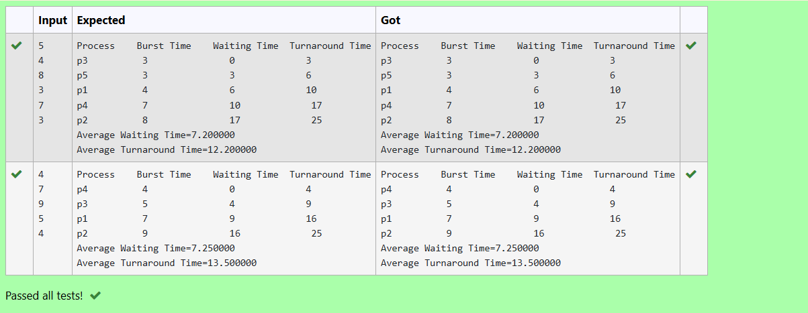

# Ex9 Applications of Queue - SJF
## DATE:
## AIM:
To incorporate the code to calculate the Total Waiting Time and Average Waiting Time in Shortest Job First scheduling algorithm.
## Algorithm
1. Read the number of processes and their burst times, assigning each a process ID.
2. Sort the processes in ascending order of burst time using selection sort.
3. Calculate the waiting time for each process by summing the burst times of all previous processes.
4. Calculate turnaround time for each process as: turnaround = burst time + waiting time.
5. Compute and display the average waiting time and average turnaround time along with each process's details.  

## Program:
```
/*
Program to find the Total Waiting Time and Average Waiting Time in Shortest Job First scheduling algorithm.
Developed by: D VERGIN JENIFER
RegisterNumber: 212223240174
#include<stdio.h>
 
int main()
{
    int bt[20],p[20],wt[20],tat[20],i,j,n,total=0,pos,temp;
    float avg_wt,avg_tat;
    //printf("Enter number of process:");
    scanf("%d",&n);
 
   // printf("\nEnter Burst Time:\n");
    for(i=0;i<n;i++)
    {
      //  printf("p%d:",i+1);
        scanf("%d",&bt[i]);
        p[i]=i+1;           //contains process number
    }
 
    //sorting burst time in ascending order using selection sort
    for(i=0;i<n;i++)
    {
        pos=i;
        for(j=i+1;j<n;j++)
        {
            if(bt[j]<bt[pos])
                pos=j;
        }
 
        temp=bt[i];
        bt[i]=bt[pos];
        bt[pos]=temp;
 
        temp=p[i];
        p[i]=p[pos];
        p[pos]=temp;
    }
 
    wt[0]=0;            //waiting time for first process will be zero
 
    //calculate waiting time
    for(int i=1;i<n;i++){
        wt[i]=0;
        for(int j=0;j<i;j++){
            wt[i]+=bt[j];
        }
        total+=wt[i];
    }
    avg_wt=(float)total/n;
    
    total=0;
 
    printf("Process    Burst Time    Waiting Time  Turnaround Time\n");
    for(i=0;i<n;i++)
    {
        tat[i]=bt[i]+wt[i];     //calculate turnaround time
        total+=tat[i];
        //printf("\n");
        printf("p%d          %d               %d             %d\n",p[i],bt[i],wt[i],tat[i]);
    }
 
    avg_tat=(float)total/n;     //average turnaround time
   // printf("\n");
    printf("Average Waiting Time=%f\n",avg_wt);
  //  printf("\n");
    printf("Average Turnaround Time=%f\n",avg_tat);
    return 0;
}

*/
```

## Output:



## Result:
Thus, the code to calculate the Total Waiting Time and Average Waiting Time in Shortest Job First scheduling algorithm is implemented successfully.
